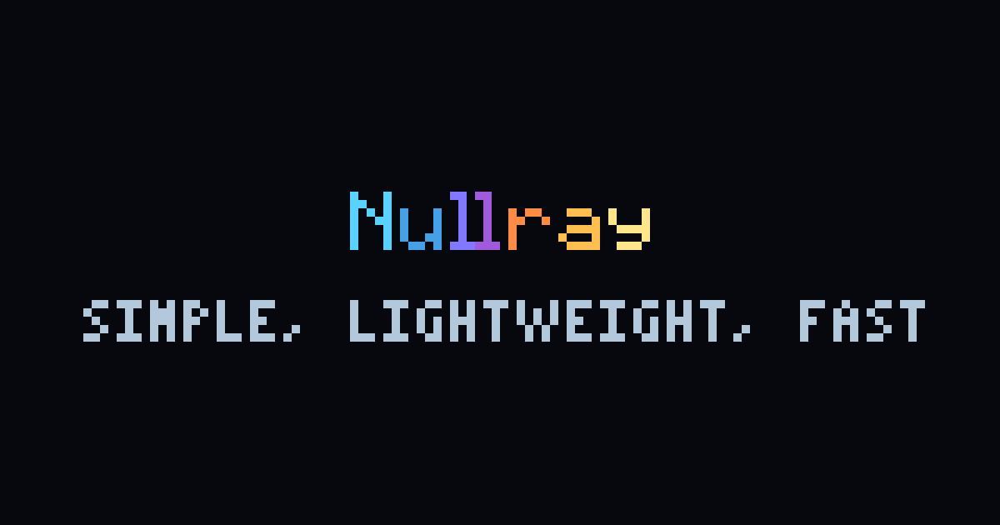

# nullray

Lightweight coding agent with a custom TUI built in Odin.



Providers: OpenAI and OpenAI-compatible endpoints, Anthropic, Gemini, Groq, DeepSeek, Mistral, Together, Fireworks, xAI, Azure OpenAI, OpenRouter, LM Studio, Ollama, OpenCode.

Platforms: Linux, macOS, Windows.

## Build

```sh
git clone git@github.com:Quad4-Software/nullray.git
cd nullray
make
make test
make install
```

PREFIX defaults to /usr/local. Needs Odin and libcurl. Without install, run ./bin/nullray. make install also puts man/nullray.1 and shell completions under share/nullray/completions/.

```sh
./bin/nullray --self-test
./bin/nullray
```

First TUI launch without a ready provider opens a setup overlay (reopen with /setup). Saves to ~/.config/nullray/env. Headless --print, --self-test, and CI never open the wizard.

## Config

~/.config/nullray/env:

```ini
NULLRAY_PROVIDER=openrouter
NULLRAY_MODEL=google/gemini-3.8-flash
NULLRAY_REASONING=low
NULLRAY_MODE=edit
NULLRAY_PERMS=allow
NULLRAY_CACHE=1
OPENROUTER_API_KEY=sk-or-...
```

Shell exports override the file. Secrets stay blocked unless listed in NULLRAY_SECRETS_ALLOW. MCP config is ~/.config/nullray/mcp.json. Key presets (default, neovim, emacs) live in keys.ini or --keys / NULLRAY_KEYS.

OpenAI-compatible local endpoint:

```ini
NULLRAY_PROVIDER=openai-compat
OPENAI_BASE_URL=http://127.0.0.1:8000/v1
OPENAI_API_KEY=optional
NULLRAY_MODEL=my-local-model
```

| Provider | Auth |
|----------|------|
| openai | OPENAI_API_KEY |
| openai-compat | base URL + optional key |
| anthropic | ANTHROPIC_API_KEY |
| gemini | GEMINI_API_KEY or GOOGLE_API_KEY |
| groq / deepseek / mistral / together / fireworks / xai | matching *_API_KEY |
| azure | AZURE_OPENAI_ENDPOINT + AZURE_OPENAI_API_KEY |
| ollama | OLLAMA_HOST |
| lmstudio | LM_API_TOKEN (defaults to lm-studio) |
| openrouter | OPENROUTER_API_KEY |
| opencode / opencode-go | OpenCode Zen |

## Usage

Modes: ask, plan, review, edit (/mode or NULLRAY_MODE). Shell perms: ask, allow, yolo. Plan mode writes under .nullray/plans/ or --plan-out. Done Contract needs Steps, Verify, Success, Budget. Headless apply: --plan-in / NULLRAY_PLAN_IN. Post-edit verify is off unless /verify on or NULLRAY_VERIFY.

```sh
nullray --print --mode ask "What does session_init do?"
nullray --print --mode plan --plan-out ./plan.md "Add ephemeral print mode"
NULLRAY_VERIFY=1 nullray --print --plan-in ./plan.md --perms yolo --bare
git diff origin/main...HEAD | nullray --print --bare --mode review --fail-on-findings "Review this PR diff"
nullray --print --mode edit --perms yolo --auto "Fix the failing test"
```

## Packages

Docker images on GHCR (master and v*.*.*, amd64/arm64)

```sh
docker pull ghcr.io/quad4-software/nullray:latest
docker compose run --rm nullray
make docker-build
```

Release tags ship Flatpak (Freedesktop 25.08) and AppImages. Prefer the slim AppImage. nullray-sdk is the offline rebuild kit (source, pinned Odin, pack tools).

```sh
flatpak install --user ./nullray_*_linux_amd64.flatpak
flatpak run io.github.Quad4_Software.nullray
chmod +x ./nullray_*_linux_amd64.AppImage && ./nullray_*_linux_amd64.AppImage
make appimage && make appimage-sdk && make flatpak
```

## License

0BSD [LICENSE](LICENSE)
